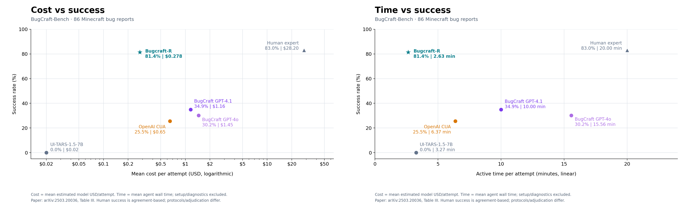

# Bugcraft-R

A Windows/Minecraft Java crash-reproduction benchmark harness using Pi and `openai-codex/gpt-6-astra` (medium thinking), with four isolated VM lanes, computer-use action batches, explicit VM pause/resume, recordings, native sessions, and usage accounting.

## Results



The completed run contains **86 attempts**: 63 crash candidates, 3 window-hang candidates, 4 reported freezes, 11 no-crash outcomes and 5 provider-blocked outcomes.

**Success metric:** the charts count 70 observed crash/hang/freeze candidates as successful reproductions: **70/86 = 81.4%**. Four freezes were manually reviewed and confirmed; target-specific verification of the remaining candidates is pending. The comparison uses different execution setups and evaluation procedures from the paper.

- Total Pi-estimated model cost: **$23.902065**; mean **$0.277931/attempt**.
- Mean agent wall time: **2.6308 minutes/attempt**, measured per case, including continuation and VM pauses. Preparation and post-evaluation diagnostics are excluded.
- Model cost estimates cover all 86 attempts, including unsuccessful and blocked attempts. Host/VM costs, setup tests and previous trials are excluded.
- Paper values were transcribed directly from **Table III** of [Agents in the Sandbox: End-to-End Crash Bug Reproduction for Minecraft](https://arxiv.org/pdf/2503.20036). Human success is the paper's agreement-based estimate; time uses its Active Time column, not human MTTR.

Curated graph inputs: [CSV](reports/comparison/comparison-data.csv), [JSON with methodology and per-attempt aggregates](reports/comparison/comparison-data.json). PNG, SVG and PDF figures are provided.

## Reproduce figures / tests

```bash
python3 -m venv .venv
. .venv/bin/activate
pip install -r requirements.txt
pytest -q
python scripts/plot_comparison.py --from-data
```

`--from-data` uses only the public curated measurements. Without that flag, plotting recomputes them from the original private attempt directories and downloaded paper PDF.

## Running new experiments

Running the benchmark requires Linux with Docker/KVM, adequate RAM/disk, QEMU utilities, a Minecraft Java account, and an authenticated Pi CLI with access to the configured model. VM setup and account login are performed locally.

1. Fetch report JSON with `python scripts/fetch_dataset.py`, then reconstruct inputs with `python -m bugcraft_bench.dataset`. The fetch records the selected upstream revision and hashes; use the protocol's original revision to recreate that exact dataset snapshot.
2. Review `scripts/fetch_guest_tools.py`, `scripts/provision_vm.py` and the PowerShell/C# guest setup in `vm/shared`. Install and authenticate Prism privately and verify a real Minecraft main menu. Complete setup and account login manually before running the benchmark.
3. Cleanly shut down the original VM before `scripts/provision_lanes.py` creates four independent overlays. Never start the archived writable backing VM while overlays are in use. Local lane configuration, private environment files and disk images are generated locally and excluded from Git.
4. Verify each lane/controller/VNC tunnel, run the recorded smoke gates, and generate local environment/gate evidence. These local validation artifacts are required before evaluation.
5. Supply a selection JSON with `case_ids` and a fresh output directory:

```bash
python scripts/run_parallel_cases.py \
  --selection /path/to/selection.json \
  --run-dir reports/my-run --concurrency 4
```

Each lane has its own run directory and mutable VM/control state. The scheduler queues the next case onto a free lane. Actor time limit is 1,200 seconds per case with no assistant-turn cap. Full session and video artifacts stay local by default. See [protocol](docs/protocol.md).

## Public repository scope

This repository includes code, protocol documentation, curated measurements and plots. We have not included agent notes, credentials, downloaded datasets and reference files, VM disks, local configuration, raw sessions, screenshots, videos or logs.

## References

- [BugCraft paper](https://arxiv.org/abs/2503.20036)
- [Original BugCraft repository](https://github.com/erayyap/bugcraft)
- [Project site](https://bugcraft2025.github.io/)
- [Dataset](https://huggingface.co/erayyapagci/bugcraft-dataset)
